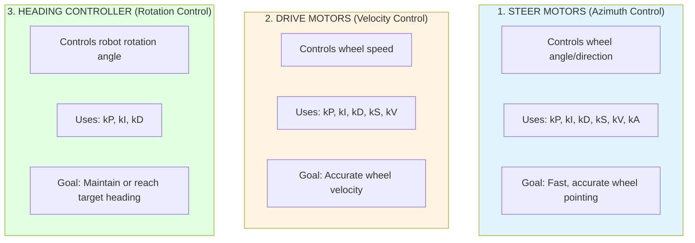

# Tuning CTRE Phoenix Swerve Drive: Complete Guide

## Table of Contents

1. [High-Level Conceptual Overview](#high-level-conceptual-overview)
2. [Understanding the Control Loops](#understanding-the-control-loops)
3. [Prerequisites and Safety](#prerequisites-and-safety)
4. [Step-by-Step Tuning Procedure](#step-by-step-tuning-procedure)
5. [Advanced Tuning Topics](#advanced-tuning-topics)
6. [Verification and Testing](#verification-and-testing)

---

## High-Level Conceptual Overview

### What is PID Control?

A swerve drive system uses multiple **closed-loop controllers** (PID + Feedforward) to achieve precise control. Think of these as autopilots for each motor:

- **P (Proportional)**: The "error correction" term - larger errors produce larger corrections
- **I (Integral)**: The "accumulated error" term - fixes persistent small errors over time
- **D (Derivative)**: The "rate of change" term - dampens oscillations and overshooting
- **Feedforward (kS, kV, kA)**: Predictive terms that compensate for known physics (friction, velocity, acceleration)

### Swerve Drive Control Architecture

Your robot has **three distinct control systems** that need tuning:



### Why Tuning Matters

- **Under-tuned**: Sluggish response, inaccurate positioning, poor path following
- **Over-tuned**: Oscillations, instability, mechanical wear, current spikes
- **Well-tuned**: Crisp response, accurate control, efficient power usage, competitive performance

---

## Understanding the Control Loops

### Steer Motor Control (TunerConstants.java)

Located in your `TunerConstants.java`:

```java
private static final Slot0Configs steerGains = new Slot0Configs()
    .withKP(100).withKI(0).withKD(0.5)
    .withKS(0.1).withKV(2.66).withKA(0)
    .withStaticFeedforwardSign(StaticFeedforwardSignValue.UseClosedLoopSign);
```

**What each gain does:**

- **kP (100)**: Main correction force - higher values = faster response but risk oscillation
- **kI (0)**: Usually 0 for steer - only add if persistent offset exists
- **kD (0.5)**: Damping - reduces overshoot and oscillation
- **kS (0.1 V)**: Voltage to overcome static friction
- **kV (2.66 V/(rot/s))**: Voltage per unit velocity - compensates for motor speed
- **kA (0)**: Usually 0 for steer - acceleration compensation

### Drive Motor Control (TunerConstants.java)

```java
private static final Slot0Configs driveGains = new Slot0Configs()
    .withKP(0.1).withKI(0).withKD(0)
    .withKS(0).withKV(0.124);
```

**What each gain does:**

- **kP (0.1)**: Velocity error correction - typically small for drive
- **kI (0)**: Usually 0 - Phoenix's velocity control is inherently integral
- **kD (0)**: Usually 0 for velocity control
- **kS (0 V)**: Static friction - often 0 with good feedforward
- **kV (0.124 V/(m/s))**: Primary gain - voltage per m/s of target velocity

### Heading Controller

This is configured separately in your `CommandSwerveDrivetrain` through `SwerveRequest.FieldCentricFacingAngle`:

- Controls robot rotation when using heading lock features
- Tuned using SysId rotation characterization
- Typically needs kP around 5-10, minimal kI, and kD around 0-0.5

---

## Prerequisites and Safety

### Before You Begin

✅ **Hardware Checklist:**

- [ ] All motor connections secure and correct polarity
- [ ] CANcoders properly mounted and wired
- [ ] Pigeon 2.0 mounted rigidly to chassis
- [ ] Battery fully charged (>12.5V)
- [ ] Robot elevated on blocks OR in safe, open area
- [ ] Emergency stop readily accessible

✅ **Software Checklist:**

- [ ] Phoenix Tuner X installed and updated
- [ ] Robot code deployed successfully
- [ ] TunerConstants.java accessible
- [ ] Logging enabled (Advantage Kit or SignalLogger)

⚠️ **Safety Reminders:**

- Start with robot on blocks when possible
- Always have a way to disable the robot quickly
- Test with LOW VOLTAGE initially (start at 4V max)
- Increase gains gradually (10-25% at a time)
- Watch for overheating motors or brownouts

---

## Step-by-Step Tuning Procedure

### Phase 1: Initial Setup and Validation (20-30 minutes)

#### 1.1 Verify Hardware Configuration

```bash
# In Phoenix Tuner X
1. Connect to robot
2. Navigate to Device List
3. Verify all devices appear (4x drive TalonFX, 4x steer TalonFX, 4x CANcoder, 1x Pigeon2)
4. Check for any faults (red indicators)
5. Verify firmware versions match across all devices
```

#### 1.2 Validate Encoder Offsets

The most critical step - incorrect offsets will cause erratic behavior:

```java
// In TunerConstants.java - verify these are set correctly
// These should be from your module calibration process
private static final int kFrontLeftEncoderId = 0;
private static final Angle kFrontLeftEncoderOffset = Rotations.of(-0.XXX);
// ... etc for all modules
```

**Calibration Process:**

1. Physically align ALL wheels straight forward (bevel gears on same side)
2. Use Tuner X to read each CANcoder's absolute position
3. Record these values as your offsets
4. Deploy and verify wheels stay straight when enabled

#### 1.3 Verify Module Inversions

```java
// In TunerConstants.java
private static final boolean kInvertLeftSide = false;
private static final boolean kInvertRightSide = true;
```

Test: Send a small forward command - all wheels should move forward (not opposing).

---

### Phase 2: Drive Motor Feedforward Tuning (30-45 minutes)

This determines how much voltage is needed per m/s of velocity.

#### 2.1 SysId Characterization (RECOMMENDED METHOD)

Phoenix includes built-in SysId routines in `CommandSwerveDrivetrain`:

```bash
# In Driver Station or code trigger
1. Deploy robot code
2. Trigger SysId Translation routine:
   - m_sysIdRoutineTranslation.quasistatic(Direction.kForward)
   - Let run for full duration (~10 seconds)
   - m_sysIdRoutineTranslation.quasistatic(Direction.kReverse)
   - m_sysIdRoutineTranslation.dynamic(Direction.kForward)
   - m_sysIdRoutineTranslation.dynamic(Direction.kReverse)
3. Extract logs from robot (Tuner X > Tools > Log Extractor)
4. Open WPILib SysId tool
5. Load logs and run analysis
6. Record kS and kV values
```

**Apply Results:**

```java
// In TunerConstants.java - Update with SysId results
private static final Slot0Configs driveGains = new Slot0Configs()
    .withKP(0.1)      // Keep initial value for now
    .withKI(0)        // Keep at 0
    .withKD(0)        // Keep at 0
    .withKS(0.25)     // Example from SysId
    .withKV(0.124);   // Example from SysId
```

#### 2.2 Manual Feedforward Tuning (ALTERNATIVE)

If SysId is unavailable:

```bash
1. Set kP = 0, kI = 0, kD = 0, kS = 0, kV = 0
2. Enable robot and command slow forward movement (0.5 m/s)
3. In Tuner X, manually increase drive motor voltage until movement occurs
4. This voltage = kS (static friction voltage)
5. Command faster speeds (1, 2, 3 m/s)
6. Record voltage needed for each speed
7. kV = (Voltage - kS) / Velocity
8. Average kV across multiple speeds
```

#### 2.3 Add Proportional Gain

Now add error correction:

```bash
1. Start with kP = 0.1
2. Command various speeds (0.5, 1.0, 2.0 m/s)
3. Plot actual velocity vs. target velocity in Tuner X
4. If velocity lags target: increase kP by 25%
5. If velocity oscillates: decrease kP by 25%
6. Repeat until velocity tracks smoothly
7. Typical final values: kP = 0.05 to 0.3
```

**Validation:**

- Velocity should reach target within 100ms
- No oscillation or bouncing
- Smooth acceleration and deceleration

---

### Phase 3: Steer Motor PID Tuning (45-60 minutes)

This controls how quickly and accurately wheels point in the correct direction.

#### 3.1 SysId Characterization (RECOMMENDED)

```bash
# Similar to drive, but for steer
1. Trigger SysId Steer routine:
   - m_sysIdRoutineSteer.quasistatic(Direction.kForward)
   - m_sysIdRoutineSteer.quasistatic(Direction.kReverse)
   - m_sysIdRoutineSteer.dynamic(Direction.kForward)
   - m_sysIdRoutineSteer.dynamic(Direction.kReverse)
2. Extract and analyze in SysId tool
3. Apply kS, kV, kA if provided
```

#### 3.2 Tune kP for Steer

**Goal:** Fast response without oscillation

```bash
1. Start with kP = 50 (or current value)
2. Command robot to drive in a circle (slow speed)
3. Watch wheels in Tuner X plots or visually
4. Too Low (kP < 50):
   - Wheels lag behind commands
   - Slow to rotate to new angles
   - Robot feels sluggish
   → Increase kP by 50%

5. Too High (kP > 200):
   - Wheels oscillate/vibrate
   - Audible hunting sound
   - Jerky motion
   → Decrease kP by 25%

6. Just Right (kP ~100-150 for most robots):
   - Wheels snap to position quickly
   - No oscillation
   - Smooth rotation
```

#### 3.3 Add Derivative Gain (kD)

**Goal:** Dampen any remaining oscillation

```bash
1. If wheels still oscillate slightly with good kP
2. Start with kD = kP / 100 (e.g., if kP=100, try kD=1.0)
3. Increase gradually until oscillation stops
4. Typical values: kD = 0.1 to 2.0
5. Too much kD: Sluggish response, feels "sticky"
```

#### 3.4 Integral Gain (kI) - Usually Not Needed

```bash
Only add kI if:
- Wheels consistently point slightly off-target
- Persistent steady-state error exists
- Start with kI = 0.01
- Increase slowly - too much causes instability
- Typical: kI = 0 (most robots don't need it)
```

**Final Steer Gains Example:**

```java
private static final Slot0Configs steerGains = new Slot0Configs()
    .withKP(120)      // Main response
    .withKI(0)        // Usually not needed
    .withKD(0.8)      // Damping
    .withKS(0.15)     // From SysId
    .withKV(2.66)     // From SysId
    .withKA(0);       // Usually 0
```

---

### Phase 4: Heading Controller Tuning (30 minutes)

This controls robot rotation when using field-centric facing angle mode.

#### 4.1 SysId Rotation Characterization

```bash
1. Trigger m_sysIdRoutineRotation routines (all 4 directions)
2. Extract logs
3. In SysId, use "Angular Drivetrain" mode
4. Get kP, kD values
```

#### 4.2 Manual Tuning

If using `FieldCentricFacingAngle` request:

```bash
1. In CommandSwerveDrivetrain, heading PID is separate
2. Start with kP = 5.0
3. Command robot to face specific angle (e.g., 90°)
4. Observe:
   - Too low kP: Slow to reach angle, drifts
   - Too high kP: Oscillates around target
5. Adjust in increments of 1.0
6. Add kD (0.1 - 0.5) to reduce oscillation
7. Typical final: kP = 7-12, kI = 0, kD = 0.2-0.8
```

---

### Phase 5: Slip Current and Speed Limits (15 minutes)

#### 5.1 Determine Slip Current

This prevents wheel slip and optimizes traction:

```bash
1. Place robot on floor (not blocks)
2. Command max acceleration forward
3. Monitor drive motor stator current in Tuner X
4. Note current when wheels start slipping
5. Set kSlipCurrent to ~80% of that value
```

```java
// In TunerConstants.java
private static final Current kSlipCurrent = Amps.of(120); // Adjust based on testing
```

#### 5.2 Validate Max Speed

```java
// Verify this matches your actual robot
public static final LinearVelocity kSpeedAt12Volts = MetersPerSecond.of(4.58);
```

Test:

1. Command full speed forward
2. Measure actual speed using odometry
3. Adjust value if significantly different

---

## Advanced Tuning Topics

### Couple Ratio Compensation

The **couple ratio** compensates for the mechanical coupling between steer and drive:

```java
private static final double kCoupleRatio = 3.5714285714285716;
```

**When to adjust:**

- If wheels speed up/slow down when steering
- Typically set by module manufacturer
- Fine-tune if you notice coupling effects

**Test:** Spin module in place rapidly - drive motor should compensate automatically.

### Current Limiting

Prevent brownouts and extend motor life:

```java
// Already in your steerInitialConfigs
.withCurrentLimits(
    new CurrentLimitsConfigs()
        .withStatorCurrentLimit(Amps.of(60))
        .withStatorCurrentLimitEnable(true)
)
```

**Adjust if:**

- Brownouts occur: Decrease limit
- Steer feels weak: Increase limit (max ~80A)

### Motion Magic vs. Basic PID

Phoenix supports Motion Magic for smooth profiling:

- Currently using basic PID (adequate for most uses)
- Motion Magic adds acceleration/velocity limits
- Consider for elevator/arm mechanisms
- Not typically used for swerve steer/drive

### CANivore and Time Synchronization

For best performance (Pro license required):

```java
// In TunerConstants.java
public static final CANBus kCANBus = new CANBus("canivore_name");
```

**Benefits:**

- Faster signal updates (250 Hz → 100+ kHz capable)
- Synchronized odometry updates
- Reduced latency
- Better trajectory following

---

## Verification and Testing

### Phase 6: Validation Tests (30 minutes)

#### Test 1: Point Wheels Forward

```bash
Result: All wheels point same direction, robot drives straight
Pass/Fail: ___________
```

#### Test 2: Spin in Place

```bash
Command: Rotate robot CCW at 0.5 rad/s
Result: Smooth rotation, all wheels angled correctly
Pass/Fail: ___________
```

#### Test 3: Figure-8 Pattern

```bash
Command: Drive figure-8 at moderate speed
Result: Smooth transitions, no jerking or stuttering
Pass/Fail: ___________
```

#### Test 4: Sudden Direction Change

```bash
Command: Drive forward, immediately switch to sideways
Result: Modules reorient quickly without excessive oscillation
Pass/Fail: ___________
```

#### Test 5: Field-Centric with Heading Lock

```bash
Command: Drive around while maintaining 0° heading
Result: Robot doesn't rotate, maintains heading ±2°
Pass/Fail: ___________
```

#### Test 6: Acceleration Test

```bash
Command: Full speed forward from stop
Result: No brownout, smooth acceleration, no slip
Pass/Fail: ___________
```

### Diagnostic Tools

#### Tuner X Plotting

```bash
Key Signals to Plot:
1. Drive: TargetVelocity vs. ActualVelocity
2. Steer: TargetPosition vs. ActualPosition
3. Steer: MotorVoltage (should be smooth, not choppy)
4. Drive: StatorCurrent (check for spikes)
5. Battery Voltage (watch for brownouts)
```

#### SignalLogger

Already integrated in your code:

```java
SignalLogger.writeString("SysIdTranslation_State", state.toString())
```

Enable in code for detailed logging:

```java
SignalLogger.start(); // In robotInit()
```

Extract logs after matches for analysis.

---

## Common Issues and Solutions

### Problem: Wheels Oscillate

**Symptoms:** Vibration, hunting, unstable
**Solutions:**

1. Decrease steer kP by 25%
2. Increase steer kD by 50%
3. Check for mechanical binding

### Problem: Sluggish Response

**Symptoms:** Slow wheel rotation, laggy control
**Solutions:**

1. Increase steer kP by 50%
2. Verify no current limiting issues
3. Check battery voltage

### Problem: Robot Doesn't Drive Straight

**Symptoms:** Curves when commanded straight
**Solutions:**

1. Recalibrate CANcoder offsets
2. Check module inversions
3. Verify drive motor feedforward (kV)

### Problem: Wheels Slip Under Acceleration

**Symptoms:** Current spikes, loss of traction
**Solutions:**

1. Decrease kSlipCurrent
2. Implement acceleration rate limiting
3. Check wheel tread condition

### Problem: Inconsistent Between Modules

**Symptoms:** Some modules respond differently
**Solutions:**

1. Verify all modules using same gains
2. Check for mechanical differences
3. Ensure firmware versions match

---

## Tuning Checklist

Print this and check off as you complete each section:

- [ ] **Phase 1:** Hardware validated, encoders calibrated
- [ ] **Phase 2:** Drive feedforward tuned (kS, kV)
- [ ] **Phase 2:** Drive kP tuned for velocity tracking
- [ ] **Phase 3:** Steer kP tuned for position control
- [ ] **Phase 3:** Steer kD added for damping
- [ ] **Phase 4:** Heading controller tuned
- [ ] **Phase 5:** Slip current determined
- [ ] **Phase 5:** Max speed validated
- [ ] **Phase 6:** All validation tests passed
- [ ] **Documentation:** Final gains recorded in TunerConstants.java

**Final Tuned Gains (Record Here):**

```java
// DRIVE GAINS
kP: ___________
kI: ___________
kD: ___________
kS: ___________
kV: ___________

// STEER GAINS
kP: ___________
kI: ___________
kD: ___________
kS: ___________
kV: ___________
kA: ___________

// HEADING GAINS
kP: ___________
kI: ___________
kD: ___________

// OTHER
kSlipCurrent: ___________
kSpeedAt12Volts: ___________
```

---

## Best Practices from Successful FRC Teams

### Industry Standards

1. **Always SysId First:** Use WPILib's SysId for initial characterization
2. **Start Conservative:** Begin with low gains and work up
3. **One Change at a Time:** Don't adjust multiple gains simultaneously
4. **Log Everything:** Enable comprehensive logging for post-match analysis
5. **Document as You Go:** Record what changes worked and why

### Competition-Ready Tuning

1. **Tune on Competition Carpet:** Floor surface drastically affects behavior
2. **Full Battery Required:** Performance varies significantly with voltage
3. **Operating Temperature:** Tune at expected competition temperatures
4. **Worn-In Wheels:** Don't tune on brand new wheels
5. **Expected Weight:** Tune with all mechanisms installed

### Maintenance Schedule

- **Pre-Competition:** Verify gains, test all scenarios
- **Between Matches:** Quick validation test
- **After Repairs:** Re-verify affected modules
- **New Wheels/Belt:** May need minor kV adjustment
