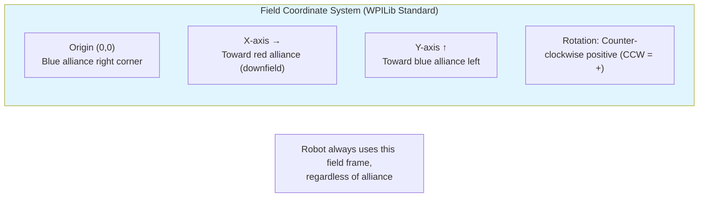
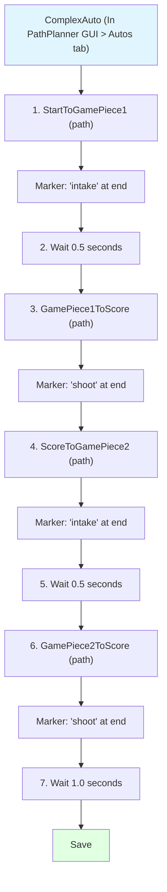

# Building Autonomous Routines with Swerve Drive

## Table of Contents

1. [Autonomous Fundamentals](#autonomous-fundamentals)
2. [PathPlanner Integration](#pathplanner-integration)
3. [Building Your First Auto](#building-your-first-auto)
4. [Advanced Techniques](#advanced-techniques)
5. [Competition Strategy](#competition-strategy)
6. [Debugging Autonomous](#debugging-autonomous)

---

## Autonomous Fundamentals

### Understanding Autonomous in FRC

**Autonomous Period:** 15 seconds at the start of each match where the robot operates without driver input.

**Why It Matters:**

- High-value scoring opportunities (often bonus points)
- Sets up advantageous field position
- Differentiator between good and great teams
- Can determine match outcome before teleop even begins

### Key Concepts

#### Coordinate Systems



#### Pose2d: Robot Position + Heading

```java
Pose2d robotPose = new Pose2d(
    2.5,  // X position (meters downfield)
    3.0,  // Y position (meters left)
    Rotation2d.fromDegrees(45)  // Heading (CCW from X-axis)
);
```

#### Trajectory: Path + Velocity Profile

A trajectory defines:

- Where robot should be at each point (X, Y, heading)
- How fast to move (velocity)
- How quickly to accelerate

#### Odometry: Tracking Position

Your swerve drivetrain automatically tracks position by integrating:

- Wheel velocities (from encoders)
- Robot heading (from Pigeon 2.0)

**Access current pose:**

```java
Pose2d currentPose = drivetrain.getState().Pose;
```

---

## PathPlanner Integration

### What is PathPlanner?

**PathPlanner** is the industry-standard tool for FRC autonomous path creation. It provides:

- Visual path editor
- Automatic trajectory generation
- Holonomic (swerve) support
- Event markers for actions during paths
- Alliance mirroring (red/blue auto-flip)

### Installation

1. **Install PathPlanner:**

   ```bash
   # In VS Code:
   # Open Command Palette (Ctrl+Shift+P)
   # Type: "WPILib: Manage Vendor Libraries"
   # Select "Install new libraries (online)"
   # Enter: https://3015rangerrobotics.github.io/pathplannerlib/PathplannerLib.json
   ```

2. **Install PathPlanner GUI:**
   - Download from: https://github.com/mjansen4857/pathplanner/releases
   - Install for your OS (Windows/Mac/Linux)
   - Launch PathPlanner application

### Configuring PathPlanner for Your Robot

#### Step 1: Create PathPlanner Project

```bash
# In PathPlanner GUI:
File > Open Project
Navigate to: C:\Users\Carson\dev\2025-swerve-offseason
Select your robot project folder
```

PathPlanner will create: `src/main/deploy/pathplanner/`

#### Step 2: Configure Robot Settings

In PathPlanner GUI:

```
Settings (gear icon) > Robot Configuration

Robot Mass: 60 kg (typical, measure yours)
MOI: 6 kg·m² (typical)
Wheel Base: [measure front-back distance, meters]
Track Width: [measure left-right distance, meters]

Max Velocity: 4.58 m/s (from TunerConstants.kSpeedAt12Volts)
Max Acceleration: 3.0 m/s² (conservative, tune later)
Max Angular Velocity: 10 rad/s (from MaxAngularRate in code)
Max Angular Acceleration: 12 rad/s² (typical)

Module Config: "Standard" (for swerve)
```

**Finding your robot dimensions:**

```java
// In TunerConstants.java, module positions indicate size:
kFrontLeftXPos = 10.5"  // Half of length
kFrontLeftYPos = 10.5"  // Half of width

// Robot dimensions:
Length = 2 * 10.5" = 21" = 0.5334 m
Width = 2 * 10.5" = 21" = 0.5334 m
```

#### Step 3: Configure AutoBuilder

In `RobotContainer.java`, add PathPlanner AutoBuilder configuration:

```java
package frc.robot;

import com.pathplanner.lib.auto.AutoBuilder;
import com.pathplanner.lib.config.PIDConstants;
import com.pathplanner.lib.config.RobotConfig;
import com.pathplanner.lib.controllers.PPHolonomicDriveController;
import edu.wpi.first.math.geometry.Pose2d;
import edu.wpi.first.wpilibj.DriverStation;
import edu.wpi.first.wpilibj.DriverStation.Alliance;
import edu.wpi.first.wpilibj2.command.Command;
import edu.wpi.first.wpilibj2.command.Commands;
import frc.robot.generated.TunerConstants;
import frc.robot.subsystems.CommandSwerveDrivetrain;

public class RobotContainer {
    private final CommandSwerveDrivetrain drivetrain = TunerConstants.createDrivetrain();

    public RobotContainer() {
        configureAutoBuilder();
        configureBindings();
    }

    private void configureAutoBuilder() {
        try {
            // Load robot configuration from PathPlanner project
            RobotConfig config = RobotConfig.fromGUISettings();

            // Configure AutoBuilder with swerve drivetrain
            AutoBuilder.configure(
                drivetrain::getPose,                    // Supplier for current pose
                drivetrain::resetPose,                  // Consumer to reset pose
                drivetrain::getChassisSpeeds,           // Supplier for current speeds
                (speeds, feedforwards) -> {             // Consumer to apply ChassisSpeeds
                    drivetrain.setControl(
                        new com.ctre.phoenix6.swerve.SwerveRequest.ApplyRobotSpeeds()
                            .withSpeeds(speeds)
                    );
                },
                new PPHolonomicDriveController(
                    new PIDConstants(5.0, 0.0, 0.0),    // Translation PID
                    new PIDConstants(5.0, 0.0, 0.0)     // Rotation PID
                ),
                config,
                () -> {
                    // Should the path be flipped for red alliance?
                    var alliance = DriverStation.getAlliance();
                    return alliance.isPresent() && alliance.get() == Alliance.Red;
                },
                drivetrain  // Subsystem requirement
            );
        } catch (Exception e) {
            System.err.println("Failed to load PathPlanner config: " + e.getMessage());
            e.printStackTrace();
        }
    }

    // ... rest of RobotContainer
}
```

**PID Gains Explanation:**

- **Translation PID (5.0, 0, 0):** Controls X/Y position following

  - Start conservative, increase kP if robot lags behind path
  - Typical range: 3.0 - 10.0 for kP
  - kI and kD usually not needed

- **Rotation PID (5.0, 0, 0):** Controls heading while driving
  - Similar tuning to translation
  - May need higher values (7-12) for tight heading control

---

## Building Your First Auto

### Step 1: Create a Simple Path

**In PathPlanner GUI:**

1. **New Path:**

   ```
   File > New Path
   Name: "SimpleDriveForward"
   ```

2. **Add Waypoints:**

   - Click on field to add waypoints
   - First waypoint (Starting pose): `(1.5, 5.5)` facing right
   - Second waypoint (End pose): `(3.0, 5.5)` facing right

3. **Configure Path Settings:**

   ```
   Max Velocity: 2.0 m/s (slow for first test)
   Max Acceleration: 2.0 m/s²

   Starting Velocity: 0 m/s
   Ending Velocity: 0 m/s
   ```

4. **Save:** `Ctrl+S`

**Files created:**

- `src/main/deploy/pathplanner/paths/SimpleDriveForward.path`

### Step 2: Create Autonomous Command

In `RobotContainer.java`:

```java
import com.pathplanner.lib.auto.AutoBuilder;
import com.pathplanner.lib.path.PathPlannerPath;
import edu.wpi.first.wpilibj.smartdashboard.SendableChooser;
import edu.wpi.first.wpilibj.smartdashboard.SmartDashboard;

public class RobotContainer {
    // ... existing code ...

    private final SendableChooser<Command> autoChooser = new SendableChooser<>();

    public RobotContainer() {
        configureAutoBuilder();
        configureBindings();
        buildAutoChooser();  // Add this
    }

    private void buildAutoChooser() {
        // Default: Do nothing
        autoChooser.setDefaultOption("None", Commands.none());

        // Simple drive forward
        autoChooser.addOption("Drive Forward",
            AutoBuilder.followPath(
                PathPlannerPath.fromPathFile("SimpleDriveForward")
            )
        );

        // Add chooser to dashboard
        SmartDashboard.putData("Auto Chooser", autoChooser);
    }

    /**
     * Returns the selected autonomous command
     */
    public Command getAutonomousCommand() {
        return autoChooser.getSelected();
    }
}
```

### Step 3: Run Autonomous

In `Robot.java`:

```java
@Override
public void autonomousInit() {
    // Get selected autonomous command
    m_autonomousCommand = m_robotContainer.getAutonomousCommand();

    // Schedule the autonomous command
    if (m_autonomousCommand != null) {
        m_autonomousCommand.schedule();
    }
}
```

### Step 4: Test in Simulation

1. **Enable Simulation:**

   ```bash
   # In VS Code terminal:
   ./gradlew simulateJava
   # Or use WPILib: "Simulate Robot Code"
   ```

2. **Open Tools:**

   - Glass (WPILib tool) or AdvantageScope
   - Add Field2d widget
   - Enable Autonomous mode in sim GUI

3. **Observe:**

   - Robot should drive forward along path
   - Check Field2d - pose should follow trajectory

4. **Verify on Real Robot:**
   - Deploy code
   - Place robot at starting position `(1.5, 5.5)`
   - Enable autonomous
   - Robot should drive forward 1.5 meters

---

## Advanced Techniques

### Adding Event Markers

Event markers trigger actions at specific points along path.

#### In PathPlanner GUI:

```
1. Select your path
2. Click "Event Markers" panel (right side)
3. Click on path where you want event
4. Add marker name: "intake", "shoot", etc.
```

#### In Code:

Create `AutoCommands.java`:

```java
package frc.robot.commands.auto;

import edu.wpi.first.wpilibj2.command.Command;
import edu.wpi.first.wpilibj2.command.Commands;

public class AutoCommands {

    /**
     * Command to run intake
     */
    public static Command intakeCommand() {
        return Commands.runOnce(() -> {
            System.out.println("Starting intake!");
            // Add your intake subsystem logic here
        });
    }

    /**
     * Command to shoot
     */
    public static Command shootCommand() {
        return Commands.sequence(
            Commands.runOnce(() -> System.out.println("Shooting!")),
            Commands.waitSeconds(1.0)
            // Add your shooter subsystem logic here
        );
    }
}
```

#### Register Events with AutoBuilder:

```java
// In RobotContainer.configureAutoBuilder():
AutoBuilder.configure(
    // ... existing parameters ...
);

// Register named commands for event markers
NamedCommands.registerCommand("intake", AutoCommands.intakeCommand());
NamedCommands.registerCommand("shoot", AutoCommands.shootCommand());
```

Now when path reaches "intake" marker, `intakeCommand()` will run automatically!

### On-The-Fly Path Generation

Generate paths programmatically for dynamic situations:

```java
import com.pathplanner.lib.path.*;

public Command driveToPosition(Pose2d targetPose) {
    return Commands.defer(() -> {
        // Get current pose
        Pose2d currentPose = drivetrain.getPose();

        // Create waypoints
        List<Translation2d> bezierPoints = PathPlannerPath.bezierFromPoses(
            currentPose,
            targetPose
        );

        // Create path
        PathPlannerPath path = new PathPlannerPath(
            bezierPoints,
            new PathConstraints(
                3.0, 2.0,  // max vel, max accel
                5.0, 4.0   // max angular vel, max angular accel
            ),
            new GoalEndState(0.0, targetPose.getRotation())  // End at target heading
        );

        // Follow the path
        return AutoBuilder.followPath(path);
    }, Set.of(drivetrain));
}
```

### Combining Multiple Paths

Create complex autonomous routines by chaining paths:

```java
public Command threePieceAuto() {
    return Commands.sequence(
        // Drive to first game piece
        AutoBuilder.followPath(PathPlannerPath.fromPathFile("StartToGamePiece1")),
        AutoCommands.intakeCommand(),

        // Drive to scoring position
        AutoBuilder.followPath(PathPlannerPath.fromPathFile("GamePiece1ToScore")),
        AutoCommands.shootCommand(),

        // Drive to second game piece
        AutoBuilder.followPath(PathPlannerPath.fromPathFile("ScoreToGamePiece2")),
        AutoCommands.intakeCommand(),

        // Return to score
        AutoBuilder.followPath(PathPlannerPath.fromPathFile("GamePiece2ToScore")),
        AutoCommands.shootCommand()
    );
}
```

### Using PathPlanner Autos (Recommended)

Instead of building in code, create entire auto in PathPlanner GUI:

```
In PathPlanner GUI:
1. Go to "Autos" tab
2. Create New Auto: "ThreePieceAuto"
3. Drag paths from list into auto sequence
4. Add event markers between paths
5. Save
```

**Load in code:**

```java
private void buildAutoChooser() {
    // Load full autonomous routine
    autoChooser.addOption("3 Piece Auto",
        AutoBuilder.buildAuto("ThreePieceAuto")
    );
}
```

**Benefits:**

- Visual editing
- Easy reordering
- Non-programmers can modify
- Automatic path chaining

---

## Competition Strategy

### Autonomous Routine Design Philosophy

#### 1. Reliability Over Complexity

```
✓ 2 pieces scored reliably > 4 pieces scored sometimes
✓ Start with simple routine, add complexity once proven
✓ Have fallback options if early steps fail
```

#### 2. Modular Design

```
Create building blocks:
- DriveToPosition(pose)
- IntakeGamePiece()
- ScoreHigh()
- ScoreLow()

Combine into full autos:
- TwoPieceHigh = DriveToPosition + Intake + DriveBack + ScoreHigh
- ThreePieceMixed = ... etc
```

#### 3. Multiple Starting Positions

```
Account for all possible starting locations:
- Left side
- Center
- Right side

Mirror paths for red/blue alliance (PathPlanner does this automatically)
```

### Alliance Coordination

Work with alliance partners:

```java
// Detect alliance color and adjust strategy:
private boolean isRedAlliance() {
    var alliance = DriverStation.getAlliance();
    return alliance.isPresent() && alliance.get() == Alliance.Red;
}

public Command getAutonomousCommand() {
    // Different auto based on alliance
    if (isRedAlliance()) {
        return redAllianceAuto();
    } else {
        return blueAllianceAuto();
    }
}
```

**OR use PathPlanner's built-in mirroring** (simpler):

- Design all paths for blue alliance
- PathPlanner automatically mirrors for red
- Configure in AutoBuilder: `() -> isRedAlliance()`

### Contingency Planning

```java
public Command robustAuto() {
    return Commands.sequence(
        // Attempt complex path
        AutoBuilder.followPath(mainPath).withTimeout(5.0),

        // Check if we're where we expect
        Commands.either(
            // Success: continue with complex auto
            complexScoringSequence(),
            // Failure: fall back to simple scoring
            simpleScoringFallback(),
            this::isInExpectedPosition
        )
    );
}

private boolean isInExpectedPosition() {
    Pose2d expected = new Pose2d(3.0, 5.5, Rotation2d.fromDegrees(0));
    Pose2d actual = drivetrain.getPose();

    double error = expected.getTranslation().getDistance(actual.getTranslation());
    return error < 0.5;  // Within 0.5 meters
}
```

### Autonomous Selector

Create comprehensive autonomous chooser:

```java
private void buildAutoChooser() {
    // Default - safest option
    autoChooser.setDefaultOption("Mobility Only", mobilityAuto());

    // Starting position variants
    autoChooser.addOption("Left - 2 Piece", leftTwoPieceAuto());
    autoChooser.addOption("Center - 3 Piece", centerThreePieceAuto());
    autoChooser.addOption("Right - 2 Piece", rightTwoPieceAuto());

    // Complexity options
    autoChooser.addOption("Simple Score", simpleScoringAuto());
    autoChooser.addOption("Complex Score", complexScoringAuto());

    // Testing
    autoChooser.addOption("Test Path", testPathAuto());

    SmartDashboard.putData("Auto Selector", autoChooser);
}
```

---

## Debugging Autonomous

### Visualization

#### Field2d Widget (Built-in)

```java
// In CommandSwerveDrivetrain.java:
private final Field2d m_field = new Field2d();

public CommandSwerveDrivetrain(...) {
    super(...);
    SmartDashboard.putData("Field", m_field);
}

@Override
public void periodic() {
    m_field.setRobotPose(getState().Pose);

    // Optionally show trajectory
    // m_field.getObject("trajectory").setTrajectory(currentTrajectory);
}
```

**View in:**

- Shuffleboard: Add "Field" widget
- Glass: Open "Field2d" visualization
- AdvantageScope: Import NetworkTables data

#### PathPlanner Trajectory Visualization

```java
// Show planned path on field:
public Command showPathCommand(String pathName) {
    return Commands.runOnce(() -> {
        PathPlannerPath path = PathPlannerPath.fromPathFile(pathName);
        m_field.getObject("trajectory").setTrajectory(
            new Trajectory(
                path.getAllPathPoints().stream()
                    .map(point -> new Trajectory.State(
                        point.getTime(),
                        point.velocityMPS,
                        0, // acceleration
                        new Pose2d(point.position, point.heading),
                        0  // curvature
                    ))
                    .toList()
            )
        );
    });
}
```

### Logging

#### PathPlanner Logging (Automatic)

PathPlanner logs:

- Target pose
- Current pose
- Velocity setpoints
- Path progression

Access via:

- AdvantageScope
- WPILib DataLog
- NetworkTables

#### Custom Logging

```java
@Override
public void periodic() {
    // Log for AdvantageScope or DataLog
    Pose2d pose = getState().Pose;
    ChassisSpeeds speeds = getState().Speeds;

    SmartDashboard.putNumberArray("Auto/Pose", new double[] {
        pose.getX(),
        pose.getY(),
        pose.getRotation().getDegrees()
    });

    SmartDashboard.putNumberArray("Auto/Speeds", new double[] {
        speeds.vxMetersPerSecond,
        speeds.vyMetersPerSecond,
        speeds.omegaRadiansPerSecond
    });

    // Log path following errors (if accessible)
    // SmartDashboard.putNumber("Auto/XError", xError);
    // SmartDashboard.putNumber("Auto/YError", yError);
    // SmartDashboard.putNumber("Auto/HeadingError", headingError);
}
```

### Common Autonomous Issues

#### Issue: Robot doesn't follow path accurately

**Symptoms:**

- Robot strays from trajectory
- Overshoots waypoints
- Cuts corners

**Solutions:**

1. **Tune PathPlanner PID gains:**

```java
// In AutoBuilder.configure():
new PPHolonomicDriveController(
    new PIDConstants(8.0, 0.0, 0.0),    // Increase kP for tighter following
    new PIDConstants(7.0, 0.0, 0.0)     // Rotation control
)
```

2. **Check odometry accuracy:**

```java
// Manually measure distance traveled vs. odometry reading
// If off by >5%, check:
// - Wheel diameter (TunerConstants.kWheelRadius)
// - Drive gear ratio
// - Drive motor kV feedforward
```

3. **Reduce path velocity:**

```
In PathPlanner GUI:
- Lower max velocity (3.0 → 2.0 m/s)
- Lower max acceleration (2.0 → 1.5 m/s²)
```

#### Issue: Robot starts at wrong position

**Symptoms:**

- Path looks wrong on field visualization
- Robot drives in unexpected direction
- Immediately drives off course

**Solutions:**

1. **Reset odometry to starting pose:**

```java
@Override
public void autonomousInit() {
    // CRITICAL: Reset to path starting pose
    Command autoCommand = autoChooser.getSelected();
    if (autoCommand != null) {
        // Reset to first path's starting pose
        PathPlannerPath firstPath = PathPlannerPath.fromPathFile("YourPathName");
        Pose2d startPose = firstPath.getPreviewStartingHolonomicPose();
        drivetrain.resetPose(startPose);

        autoCommand.schedule();
    }
}
```

2. **Physical positioning:**
   - Measure and mark starting positions on practice field
   - Use tape to align robot precisely
   - Check that starting pose in PathPlanner matches physical position

#### Issue: Path plays correctly then robot drifts

**Symptoms:**

- Path following looks good initially
- After path ends, robot drifts or rotates

**Solutions:**

1. **Add brake at end:**

```java
public Command autoWithBrake() {
    return Commands.sequence(
        AutoBuilder.followPath(path),
        drivetrain.applyRequest(() -> new SwerveRequest.SwerveDriveBrake())
    );
}
```

2. **Check end velocity:**

```
In PathPlanner GUI:
- Set ending velocity to 0 m/s
- Add rotation constraint at end
```

---

## Autonomous Routine Templates

### Template 1: Simple Mobility

Leave starting zone for points:

```java
public Command mobilityAuto() {
    return Commands.sequence(
        // Reset odometry
        Commands.runOnce(() -> drivetrain.seedFieldCentric()),

        // Drive forward 2 meters
        AutoBuilder.followPath(
            PathPlannerPath.fromPathFile("Mobility")
        ),

        // Stop
        drivetrain.applyRequest(() -> new SwerveRequest.SwerveDriveBrake())
    );
}
```

**PathPlanner path "Mobility":**

- Start: Your starting position
- End: 2 meters forward
- Max velocity: 2.0 m/s
- Straight line

### Template 2: Score Pre-Load

Score starting game piece:

```java
public Command scorePreloadAuto() {
    return Commands.sequence(
        // Start at scoring position
        Commands.runOnce(() -> drivetrain.resetPose(scoringPose)),

        // Score
        AutoCommands.shootCommand(),

        // Back away
        AutoBuilder.followPath(
            PathPlannerPath.fromPathFile("ScoreToSafe")
        )
    );
}
```

### Template 3: Two Piece

Score pre-load + one picked up:

```java
public Command twoPieceAuto() {
    return Commands.sequence(
        // Initialize
        Commands.runOnce(() -> {
            PathPlannerPath firstPath = PathPlannerPath.fromPathFile("StartToGamePiece");
            drivetrain.resetPose(firstPath.getPreviewStartingHolonomicPose());
        }),

        // Drive to game piece
        AutoBuilder.followPath(
            PathPlannerPath.fromPathFile("StartToGamePiece")
        ),

        // Intake
        AutoCommands.intakeCommand().withTimeout(2.0),

        // Return to scoring
        AutoBuilder.followPath(
            PathPlannerPath.fromPathFile("GamePieceToScore")
        ),

        // Score
        AutoCommands.shootCommand(),

        // Done - brake
        drivetrain.applyRequest(() -> new SwerveRequest.SwerveDriveBrake())
    );
}
```

### Template 4: Complex Multi-Action

Use PathPlanner Autos (GUI-based):



**Load in code:**

```java
autoChooser.addOption("Complex Auto", AutoBuilder.buildAuto("ComplexAuto"));
```

**Benefits:**

- Non-programmers can edit
- Visual sequencing
- Easy timing adjustments
- Reusable paths

---

## Performance Optimization

### Reducing Autonomous Command Overhead

```java
// BAD: Creating new commands every cycle
public Command getAuto() {
    return Commands.sequence(
        drivetrain.applyRequest(() -> drive.with...),  // Allocates objects!
        // ...
    );
}

// GOOD: Reuse commands
private final Command mobilityAuto = buildMobilityAuto();

public Command getAuto() {
    return mobilityAuto;  // Returns same instance
}
```

### Path Caching

```java
// Load paths once in constructor:
private final Map<String, PathPlannerPath> pathCache = new HashMap<>();

public RobotContainer() {
    // Pre-load all paths
    pathCache.put("StartToGamePiece", PathPlannerPath.fromPathFile("StartToGamePiece"));
    pathCache.put("GamePieceToScore", PathPlannerPath.fromPathFile("GamePieceToScore"));
    // ... etc
}

// Use cached paths:
public Command twoPieceAuto() {
    return Commands.sequence(
        AutoBuilder.followPath(pathCache.get("StartToGamePiece")),
        AutoBuilder.followPath(pathCache.get("GamePieceToScore"))
    );
}
```

---

## Testing Autonomous

### Simulation Testing

```java
// Enable detailed simulation:
@Override
public void simulationPeriodic() {
    drivetrain.updateSimState(0.020, RobotController.getBatteryVoltage());
}
```

**Verify:**

- Path looks correct in Field2d
- Robot reaches target positions
- Timing is reasonable
- No command conflicts

### Dry Runs

Before competition:

```
□ Test each autonomous routine 5+ times
□ Verify from all starting positions
□ Test with low battery (11.5V)
□ Test on competition carpet (different friction)
□ Time each routine (must be <15 seconds)
□ Verify no brownouts or faults
□ Document any issues and fixes
```

### Competition Day Testing

```
□ Run autos in practice matches
□ Verify starting positions with field crew
□ Check alliance color flipping works
□ Have backup/simpler auto ready
□ Document what worked/didn't for next match
```
